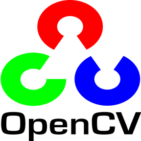

# Pencil Sketch Effect
Everyone loves creating a sketch or potraits of their pictures with great details.<br> 
Here we are with another visual effect **The Pencil Sketch** effect. This project demonstrates how to<br>
apply such kind of effect in an image.<br>
This is a good approache towards making some good pencil sketches.<br>
This projects involves various methods like image sharpening, applying grayscale, gaussian blurs and <br>
invertion of an image.This project is a combination of our previous basic projects.<br>

## Tools and Languages:



<br>

## Installation
Use the package manager [pip](https://pip.pypa.io/en/stable/) to install cv2 and numpy.


```bash
pip install cv2
pip install numpy
```

## Import
Use [import](https://www.w3schools.com/python/ref_keyword_import.asp) keyword to import modules.
```python
import cv2
import numpy as np
```

## Reading image from file

```python
img = cv2.imread("cat.png")
```

## Concepts and steps :
**1**.*Sharpen* the original image.<br> 
  ## Sharpening:
  
   ```python
  kernel_sharpening = np.array([[-1,-1,-1], 
                              [-1, 9,-1],
                              [-1,-1,-1]])
  sharpened = cv2.filter2D(img,-1,kernel_sharpening)
   ```

**2**.Convert sharpened image into *Gray scale*.<br>
  ## Grayscale:
  
   ```python
   gray = cv2.cvtColor(sharpened , cv2.COLOR_BGR2GRAY)
   ```

**3**.Generate the *negative or inverted* image of grayscaled & store it.<br>
  ## Invertion:
  ```python
  inv = 255-gray
  ```
  
**4**.Apply *Gaussian blur* to the inverted image.<br>
  ## Gaussian blur:
  ```python
  gaussgray = cv2.GaussianBlur(inv,ksize=(15,15),sigmaX=0,sigmaY=0)
  ```

Now we have gaussian blured image of inverted image and also gray image as well.In-order to generate pencil-sketh<br>
we need to merge both inverted image and gray image.In-order to do so we will b using improved dodging method <br>
defined below.<br>

```python
def dodgeV2(image,mask):
    return cv2.divide(image,255-mask,scale=256)
```
Now we need to apply this to our image<br>

```python
pencil_img = dodgeV2(gray,gaussgray)
```

## Completion message

```python
print('Pencil Sketch effect Applied.')
```

## Comparing original vs sketch

```python
cv2.imshow('ORIGINAL',img)
cv2.imshow('PENCIL-SKETCH',pencil_img)
cv2.waitKey(0)
cv2.destroyAllWindows()

```

## Images
<p align="center">
	
	
</p>

### Developed by
 [Ashish ku. Behera](https://github.com/ashish-max "Github Id")
